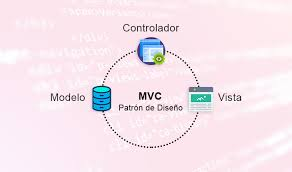

El objetivo es  poder hacer consultas de la base de datos PokemonDb que extraer información sobre pokemon en específico, información sobre los distintos itemsP del juego y datos de los Trainers .

***

### Esta app tiene dos partes

[ App PokemonDb ](https://github.com/DiazLuisAlejandro/DBProyecto/wiki/La-App-de-PokémonDb)

En esta partese verá como esta contruida la app .

[ Base de datos PokemonDb ](https://github.com/DiazLuisAlejandro/DBProyecto/wiki/Hoja-de-especificaciones)

En esta parte se verá como esta construida la base de datos

## Aplicación PokemonDb

#### [ App ](https://github.com/DiazLuisAlejandro/DBProyecto/wiki/La-App-de-PokémonDb)

#### [ Test ](https://github.com/DiazLuisAlejandro/DBProyecto/wiki/Test)

****

## Base de datos PokemonDb

#### [ Hoja de especificaciones ](https://github.com/DiazLuisAlejandro/DBProyecto/wiki/Hoja-de-especificaciones)

   La hoja de especificaciones contiene las entidades que van a estar en la base de datos.

****

## Metodología del Utilizadad 

La metología utilizada es MVC(Modelo-Vista-Controlador)

***

## Frameworks Utilizados

### Spring Boot

Spring Boot es un framework basado en Spring que simplifica el desarrollo de aplicaciones Java. Proporciona un conjunto de herramientas para crear aplicaciones web robustas y escalables de manera rápida y eficiente.

 

### MongoDB

MongoDB es una base de datos NoSQL de código abierto, orientada a documentos. Utiliza documentos similares a JSON con esquemas dinámicos, lo que facilita la integración de datos en ciertos tipos de aplicaciones.

****

## Herramientas para Testing

### JUnit

JUnit es un framework de pruebas unitarias para el lenguaje de programación Java. Es fundamental para el desarrollo dirigido por pruebas (TDD) y se utiliza para crear y ejecutar casos de prueba automatizados.

 

### Mockito

Mockito es un framework de simulación para pruebas unitarias en Java. Permite crear objetos simulados y definir su comportamiento, facilitando la realización de pruebas aisladas de las diferentes partes de la aplicación.

 

Este enfoque garantiza una estructura clara y organizada del código, mejorando tanto la mantenibilidad como la escalabilidad del proyecto.

